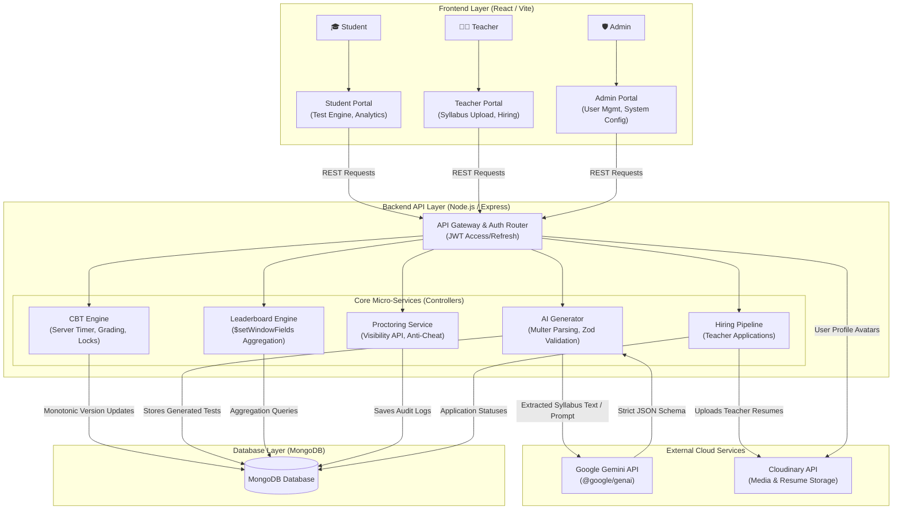

# AlgoPrep

> AlgoPrep is a comprehensive computer-based testing platform designed specifically for computer science students and educators. It enables users to take proctored, time-bound technical assessments while leveraging AI to generate customized practice tests directly from syllabus documents.


## Overview
This platform serves as a vital bridge between academic learning and technical interviews, helping computer science candidates identify their weak areas through detailed analytics and personalized AI revision plans. By providing a realistic, proctored test environment with strict time limits, it helps students build confidence and improve their problem-solving speed under pressure. For educators and recruiters, AlgoPrep offers a secure, reliable, and automated way to evaluate a candidate's core computer science fundamentals.

## ✨ Key Features (Built for Scale & Integrity)

- 🤖 **AI-Powered Test Generation**: Integrates the Gemini API to parse uploaded syllabus PDFs and synthesize customized, strict JSON-schema validated practice exams. Includes automatic repair retries and user-keyed rate limiting.
- 🔒 **Proctored Anti-Cheat System**: Utilizes the browser Visibility API to detect tab-switching and focus loss, reporting anomalies directly to the server to maintain test integrity.
- ⏱️ **Server-Authoritative Test Engine**: Features a zero-trust architecture with a server-side countdown timer and **monotonic version locking** to prevent race conditions or out-of-order save data corruption during active attempts.
- 📊 **Advanced Analytics & AI Revision**: Provides detailed scorecards (percentiles, accuracy) and a personalized, AI-generated 3-step study recommendation plan based on the candidate's incorrect answers.
- 🏆 **High-Performance Leaderboards**: Employs complex MongoDB aggregation pipelines (`$setWindowFields`) to calculate global and per-test rankings, including multi-field tie-breaker rules.
- 🧑‍🏫 **Educator Hiring Pipeline**: A dedicated, streamlined workflow for recruiting, evaluating, and onboarding teachers applying to join the AlgoPrep platform.

---

## 📸 Application Screenshots

*(Replace the placeholder links with your actual screenshot paths once you take them)*

### 🎓 Student Portal
| Dashboard | Test Interface |
| :---: | :---: |
|  |  |
| **Leaderboard** | **Analytics & AI Revision** |
|  |  |

### 🧑‍🏫 Teacher Portal
| Educator Dashboard | Syllabus Upload (AI Gen) |
| :---: | :---: |
|  |  |
| **Test Management** | **Candidate Analytics** |
|  |  |

### 🛡️ Admin Portal & Hiring
| Admin Dashboard | Hiring Pipeline Workflow |
| :---: | :---: |
|  |  |
| **User Management** | **System Configuration** |
|  |  |

---

## 🛠️ Comprehensive Tech Stack

### 🖥️ Frontend (Client)
- **Core Framework**: React 19, React DOM 19
- **Build Tool**: Vite (Lightning-fast HMR)
- **Routing**: React Router DOM v7
- **Styling**: Tailwind CSS v4, PostCSS
- **Data Visualization**: Recharts (for Analytics & Scorecards)
- **Icons**: Lucide React
- **Real-time**: Socket.io Client

### ⚙️ Backend (Server)
- **Runtime & Framework**: Node.js, Express.js
- **Database & ODM**: MongoDB, Mongoose
- **Authentication & Security**: JWT (JSON Web Tokens), bcryptjs, Helmet, Express Rate Limit, CORS
- **AI Integration**: Google Gemini API (`@google/genai`)
- **Schema Validation**: Zod (Strict JSON parsing)
- **File Processing & Storage**: Multer, Cloudinary SDK, Streamifier
- **Document Parsing**: PDF-Parse (for Syllabus text extraction)

### 🧪 Testing & Quality Assurance
- **Unit & Integration**: Vitest, Supertest
- **E2E Testing**: Puppeteer
- **Mock Database**: MongoDB Memory Server

---

## 🏗️ System Architecture & System Design

AlgoPrep employs a robust, zero-trust Client-Server architecture designed for high availability and strict data integrity during live exams. Below is the visual workflow mapping how our React frontend portals, Node.js backend micro-services, MongoDB aggregation pipelines, and the Gemini AI engine interact in real-time.



---

## 📡 API Overview & Documentation

AlgoPrep exposes a comprehensive RESTful API. Below is the complete, exhaustive list of all API routes implemented across the micro-services. All protected routes require a JWT Bearer token in the `Authorization` header.

### 🛡️ Authentication & User Management
| Method | Endpoint | Description | Access |
| :--- | :--- | :--- | :--- |
| `POST` | `/api/auth/signup` | Register a new user | Public |
| `POST` | `/api/auth/login` | Authenticate user & receive JWT tokens | Public |
| `POST` | `/api/auth/refresh` | Refresh access token | Public |
| `POST` | `/api/auth/logout` | Invalidate token and logout | Authenticated |
| `GET` | `/api/users/profile` | Get current user's profile | Authenticated |
| `PATCH` | `/api/users/profile` | Update profile information | Authenticated |
| `POST` | `/api/users/avatar` | Upload user profile avatar (Cloudinary) | Authenticated |

### 📝 Test Engine & Attempts (CBT)
| Method | Endpoint | Description | Access |
| :--- | :--- | :--- | :--- |
| `GET` | `/api/tests` | Fetch all available tests | Optional JWT |
| `POST` | `/api/tests` | Create a new custom test | Teacher |
| `GET` | `/api/tests/:id` | Fetch specific test details (Masked answers) | Optional JWT |
| `DELETE`| `/api/tests/:id` | Delete a test | Authenticated |
| `POST` | `/api/tests/:id/start` | Start a test attempt & server timer | Student |
| `GET` | `/api/attempts/user/my-attempts`| Fetch candidate's attempt history | Student |
| `GET` | `/api/attempts/:id` | Get details of an active attempt | Student/Admin |
| `PATCH` | `/api/attempts/:id/progress` | Auto-save progress with monotonic lock | Student |
| `POST` | `/api/attempts/:id/submit` | Submit test and calculate final score | Student |
| `GET` | `/api/attempts/:id/review` | Review submitted test & answer keys | Student |

### 🤖 AI, Analytics & Leaderboard
| Method | Endpoint | Description | Access |
| :--- | :--- | :--- | :--- |
| `POST` | `/api/ai/generate` | Generate syllabus-to-test via Gemini AI | Rate-Limited |
| `GET` | `/api/attempts/:id/ai-revision` | Get AI-generated 3-step revision plan | Student |
| `GET` | `/api/leaderboard` | Get global & per-test rankings via Aggregation| Authenticated |

### 🧑‍🏫 Teacher Portal & LMS Features
| Method | Endpoint | Description | Access |
| :--- | :--- | :--- | :--- |
| `GET` | `/api/teachers` | Fetch public directory of teachers | Public |
| `GET` | `/api/teachers/:id` | Fetch specific teacher details | Public |
| `POST` | `/api/memberships/join/:teacherId`| Join a teacher's classroom | Student |
| `DELETE`| `/api/memberships/leave/:teacherId`| Leave a teacher's classroom | Student |
| `GET` | `/api/memberships/my-teachers` | Fetch teachers the student is following | Student |
| `GET` | `/api/memberships/roster` | Fetch students enrolled in teacher's class | Teacher |
| `DELETE`| `/api/memberships/roster/:studentId`| Remove student from class roster | Teacher |
| `POST` | `/api/announcements` | Create a new class announcement | Teacher |
| `GET` | `/api/announcements/mine` | Fetch teacher's announcements | Teacher |
| `DELETE`| `/api/announcements/:id`| Delete an announcement | Teacher |
| `GET` | `/api/announcements/feed` | Fetch announcement feed for student | Student |
| `POST` | `/api/lectures` | Create and publish a new lecture | Teacher |
| `GET` | `/api/lectures/mine` | Fetch teacher's lectures | Teacher |
| `GET` | `/api/lectures/:id` | View specific lecture details | Authenticated |
| `DELETE`| `/api/lectures/:id` | Delete a lecture | Teacher |
| `GET` | `/api/lectures/feed` | Fetch lecture feed for enrolled student | Student |

### 💬 Real-time Messaging
| Method | Endpoint | Description | Access |
| :--- | :--- | :--- | :--- |
| `POST` | `/api/messages` | Send a direct message | Authenticated |
| `GET` | `/api/messages/contacts` | Fetch list of messaging contacts | Authenticated |
| `GET` | `/api/messages/conversations` | Fetch recent conversations | Authenticated |
| `GET` | `/api/messages/conversations/:id`| Fetch messages within a conversation | Authenticated |

### 👑 Admin & Hiring Pipeline
| Method | Endpoint | Description | Access |
| :--- | :--- | :--- | :--- |
| `POST` | `/api/teacher-applications/apply`| Submit application & resume (Cloudinary) | Public |
| `GET` | `/api/admin/teacher-applications`| List pending teacher applications | Admin |
| `PATCH` | `/api/admin/teacher-applications/:id`| Approve/Reject application | Admin |
| `GET` | `/api/admin/users` | List all registered users in system | Admin |
| `PATCH` | `/api/admin/users/:id/status` | Suspend/Ban or update user status | Admin |

### ⚙️ System
| Method | Endpoint | Description | Access |
| :--- | :--- | :--- | :--- |
| `GET` | `/api/health` | Service health check | Public |

---

## 📁 Project Structure

AlgoPrep uses a modern monorepo structure, cleanly separating the React frontend from the Node.js backend.

```text
AlgoPrep/
├── client/                     # Frontend Workspace (Vite + React)
│   ├── src/
│   │   ├── components/        # Reusable UI components (Modals, QuestionPalette, Timer)
│   │   ├── context/           # Global state management (AuthContext)
│   │   ├── pages/             # Route-level views (Dashboard, TestTaking, Leaderboard, SyllabusAI)
│   │   ├── services/          # API client wrappers handling token auto-refresh
│   │   └── types/             # Frontend type definitions/constants
│   └── package.json           # Client dependencies (Tailwind, Recharts, React Router)
│
├── server/                     # Backend Workspace (Node.js + Express)
│   ├── src/
│   │   ├── config/            # Environment vars and Database connection
│   │   ├── controllers/       # Core business logic for APIs
│   │   ├── middleware/        # JWT auth, Zod validation, Multer file upload, Rate limiting
│   │   ├── models/            # Mongoose schemas (User, Test, Attempt, Question)
│   │   ├── routes/            # Express router definitions
│   │   ├── seeds/             # Seed scripts (CS Topic Tests, dummy users)
│   │   ├── services/          # External integrations (Cloudinary storage, Gemini AI)
│   │   ├── socket/            # Real-time WebSocket handlers
│   │   └── utils/             # Helper functions (Scoring, PDF extraction, formatters)
│   ├── tests/                 # Vitest & Supertest integration suites
│   └── package.json           # Server dependencies (Mongoose, GenAI, Zod, JWT)
│
├── INTERVIEW_PREP.md           # Extensive System Design & Architectural Guide
└── README.md                   # Project Documentation
```

---

## ⚡ Installation and Setup

Follow these steps to get AlgoPrep running on your local machine for development and testing.

### 1. Prerequisites
- **Node.js**: v18.x LTS or higher
- **npm** or **pnpm** package manager
- **MongoDB**: A running local instance (`mongodb://127.0.0.1:27017`) or a MongoDB Atlas cluster URI.

### 2. Clone the Repository & Install Dependencies
Clone the project and install the dependencies for the root, server, and client workspaces:

```bash
# Clone the repository
git clone https://github.com/your-username/AlgoPrep.git
cd AlgoPrep

# Install root dependencies (for concurrently)
npm install

# Install backend dependencies
cd server
npm install
cd ..

# Install frontend dependencies
cd client
npm install
cd ..
```

### 3. Environment Configuration
Create a `.env` file in the **root** directory of the project. You can copy the provided `.env.example` template:

```bash
cp .env.example .env
```

Ensure the following essential variables are populated:
```env
PORT=5000
MONGODB_URI=mongodb://127.0.0.1:27017/algoprep
JWT_ACCESS_SECRET=your_super_secure_access_secret
JWT_REFRESH_SECRET=your_super_secure_refresh_secret
GEMINI_API_KEY=your_gemini_api_key_here
NODE_ENV=development
```

### 4. Database Seeding (First-Time Setup)
Seed your MongoDB database with the 25 core CS topic tests (375 questions) and generate dummy student and admin accounts:

```bash
# From the root directory
npm run seed
```
*(Check your console output for the generated admin credentials if you did not specify `ADMIN_SEED_PASSWORD` in your `.env`)*

### 5. Running the Application Locally
AlgoPrep uses `concurrently` in the root workspace to launch both the frontend and backend simultaneously. 

From the **root directory**, run:
```bash
npm run dev
```

- The **Backend API** will start on `http://localhost:5000`
- The **Vite Frontend** will start on `http://localhost:5173`

Open your browser and navigate to `http://localhost:5173` to start using AlgoPrep!

---

## ⚙️ Configuration Variables

AlgoPrep requires a `.env` file at the root of the project to manage environment-specific variables securely. Below is a comprehensive list of all configuration variables used by the application, their purposes, and their defaults.

### Backend (Server) Configuration

| Variable | Description | Default / Example |
| :--- | :--- | :--- |
| `PORT` | The port the Node.js API server listens on | `5000` |
| `MONGODB_URI` | The connection string for the MongoDB instance | `mongodb://127.0.0.1:27017/algoprep` |
| `NODE_ENV` | Current execution environment (`development`, `production`) | `development` |
| `JWT_ACCESS_SECRET` | Secret key for signing short-lived access tokens | *(Required string)* |
| `JWT_REFRESH_SECRET` | Secret key for signing long-lived refresh tokens | *(Required string)* |
| `GEMINI_API_KEY` | Google API Key required for AI generation features | *(Required for AI)* |
| `ADMIN_SEED_PASSWORD` | Pre-defined password for the `admin@algoprep.com` account when running the `npm run seed` script | *(Generates random password if empty)* |
| `CLOUDINARY_CLOUD_NAME` | Cloudinary account name for production media/resume storage | *(Optional in dev)* |
| `CLOUDINARY_API_KEY` | Cloudinary API Key | *(Optional in dev)* |
| `CLOUDINARY_API_SECRET` | Cloudinary API Secret | *(Optional in dev)* |

### Frontend (Client) Configuration

Create a `.env` file inside the `client` directory if you need to override frontend-specific Vite variables (by default, Vite proxies `/api` to `http://localhost:5000`):

| Variable | Description | Default / Example |
| :--- | :--- | :--- |
| `VITE_API_URL` | The absolute base URL for all API calls made by the React frontend | `/api` |
